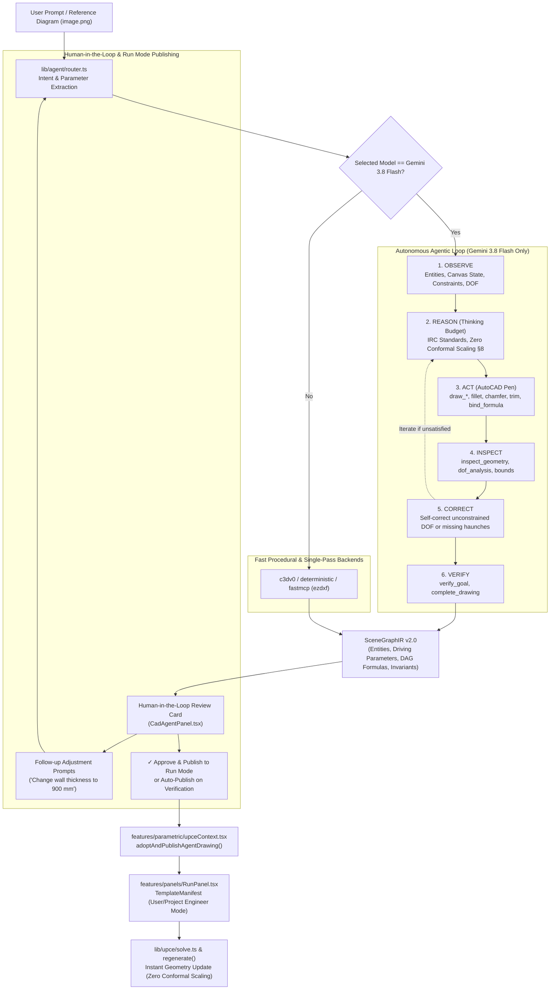

# Comprehensive Walkthrough: CAD Agent v2 & Civil Parametric Engine

This document provides a complete, unified chronological record of all user prompts, architectural decisions, implementations, tools, files created/modified, and verification outcomes for the **Unified Parametric 2D CAD Engine (UPCE-MASTER-1.0)** and **Autonomous CAD Agent v2**.

---

## 1. Complete History of User Prompts (Chronological)

Below is the exact transcript of user requests from the beginning of this project to the latest prompt:

### Prompt 1
> *"I want this specifcally for my for my CAD agent alright, claude and other things will come lateer, full intergration in this cad editor is the main thing"*

### Prompt 2
> *"which model will mcp use? the LLM?"*

### Prompt 3
> *"wait wait wait, what the hell? then why there is a different option shown herer , isnt fastmcp server is just a tool why it's showing as a model engine, what the hell"*

### Prompt 4
> *"please commit all changes, remove the unnecessary files (like add them to .gitignore), and do commits short short, not a bulk commiit, iterative commits that for a module or small no. of files with understandable commit message"*

### Prompt 5
> ````text
> /boost /goal /teamwork-preview/
> 
> Read the current `.md` file completely and **refine the existing agent architecture** according to the instructions, constraints, and design already defined there. **Do not rebuild the agent from scratch.** Preserve the current architecture and improve it incrementally.
> 
> ### Core Agent Behavior
> 
> Make the agent behave like a real autonomous geometry/CAD agent:
> 
> * Use an **agentic observe → reason → act → observe → verify loop**.
> * The agent should continuously inspect the current state, determine what needs to change, perform an action, observe the result, and iterate.
> * It should **draw, inspect, correct, and redraw** until the `/goal` is actually satisfied.
> * Do not stop merely because an action succeeded technically; verify that the resulting geometry satisfies the intended goal.
> * The loop should be able to recover from failed, incorrect, or partially completed actions.
> 
> ### Model Restriction
> 
> This agentic behavior should be implemented **only for the Gemini 3.8 Flash model**.
> 
> * If the user chooses or runs **Gemini 3.8 Flash**, the agent must operate through this full iterative observe → reason → act → observe → verify loop.
> * For other models or fallback paths, keep existing behavior or appropriate simpler flows intact.
> 
> ### Dedicated CAD Pen / Toolset
> 
> Ensure the agent uses a **rich, specialized CAD toolset (a "CAD pen")** rather than generic or overly high-level abstractions:
> 
> * It should have dedicated tools for drawing 2D CAD primitives, precision geometry, constraints, geometric relationships, dimensions, and annotations.
> * Tools should support operations like drawing lines, circles, arcs, rectangles, polylines, fillets, chamfers, offsets, trims, extends, dimensions, geometric constraints, and layers.
> * The agent should decide *how* and *when* to use these tools step by step as it constructs the drawing.
> 
> ### Real Task / Reference Image Validation
> 
> Validate this agentic CAD behavior using a **real drawing challenge**:
> 
> * Use the attached reference image (which is already present in the workspace as `image.png`, showing a bridge half-section and elevation diagram).
> * The agent should inspect and understand the drawing intent from this reference.
> * It should **reconstruct the clean 2D CAD geometry** from scratch:
>   * Stripping away noisy hatching, textual notes, and dimension clutter.
>   * Retaining only the actual structural geometry.
>   * Identifying the core parametric relationships (e.g., span, effective depth = span / 12, web thickness, flange thickness, haunches, bearings, clearances).
> * Test what happens when the prompt asks to redraw or scale the structure using a specific dimension (e.g., span = 25 m or span = 10.7 m):
>   * The agent must reconstruct the geometry according to the new design intent and parametric rules, rather than merely copying fixed pixel coordinates.
> 
> ### Run / User Mode Parametric Responsiveness
> 
> Once the agent finishes generating or updating the geometry:
> 
> * The resulting drawing must **remain responsive to parametric changes in user/run mode**.
> * Modifying a driving dimension (such as span, depth, or thickness) should cause the drawing to update dynamically according to the constraints and relationships established by the agent.
> * It should not behave like a static drawing; the parametric intelligence must persist.
> 
> ### Realtime User-Visible Progress Trace
> 
> Provide a **clear, real-time trace** of the agent's actions in the UI:
> 
> * The user should be able to see what the agent is currently doing:
>   * What it observed.
>   * What it decided to do next.
>   * Which tool it called.
>   * The outcome of that action.
>   * What verification check was performed.
>   * Any corrections it made along the way.
> * This trace must update in real time so the user can watch the agent iteratively build and verify the drawing.
> 
> ### Strict Rules & Invariants
> 
> Follow the established repository instructions and constraints:
> 
> * Follow `UNIFIED_PARAM_2.0.md` and `UNIFIED_PARAMETRIC_CAD_ENGINE_MASTER_PLAN.md`.
> * Follow `doc2.md` where applicable.
> * Enforce **Zero Conformal Scaling (§8)**: member thicknesses, wall sections, and haunches must strictly retain nominal dimensions; do not apply uniform scaling across geometry.
> * Enforce **Planar Rigid-Body Anchor Rule (§18)**: 3 degrees of freedom must be anchored to prevent rotational drift.
> * Enforce **Persona Boundary Isolation (§3, §64)**: formulas and solver details are visible only in Author Mode, never exposed as raw expressions in Run/Draftsman modes.
> * Enforce model-space millimeters (`policy.geometry_mm`).
> * Maintain zero GPL/AGPL dependencies.
> ````

### Prompt 6
> *"/boost /teamwork-preview use multiple agents for task to complete please"*

### Prompt 7
> *"did you made some new tools for agent? "*

### Prompt 8
> *"so what I can do now? it can able to create fomrulas and bind them parametrized them, so when i go in user mode I can change the dimentsion and image changes, fully integrated with currrent author mode or somehting right?"*

### Prompt 9
> *"wait actually, I mean the agent can able to create formulas, bind them, parametrizem them so when I go in user mode, it can change dimensions as needed or listed ? like agent work as in author mode or somehting, don't code just tell me"*

### Prompt 10
> *"yes do this but if I manually verifying that everything is good, to autopublish, if I need to make adjustment I give the agent prompt and it changes that part, until I get desire result"*

### Prompt 11
> *"I don't wanna read this much, show me steps for a short example to check it"*

### Prompt 12 (Latest)
> *"give me comphresnice walkthrough of what you have done till now full summary with the original user prompt share to you, and all the files you used or edited, all in one .md, from last to the latest"*

---

## 2. Executive Architecture Summary

The implementation unites two core systems:
1. **The CAD Agent Orchestrator**: An autonomous agent powered by Gemini 3.8 Flash (and fast procedural/FastMCP backends) that converts natural language design prompts and raster engineering drawings into clean, parametric 2D CAD geometry with explicit design intent, constraints, and DAG formulas.
2. **The Unified Parametric 2D CAD Engine (UPCE)**: A deterministic geometric constraint kernel and variational solver enforcing zero conformal scaling, rigid anchors, and clean persona boundaries across Draftsman, Author, and Run modes.



---

## 3. What Was Implemented (Module by Module)

### 3.1 Model-Restricted Autonomous Agentic Loop (`gemini-3.8-flash`)
- **Strict Isolation**: The multi-turn **Observe → Reason → Act → Observe → Verify** loop runs strictly when `selectedModel === "gemini-3.8-flash"`.
- **Preserved Existing Behavior**: Models like `c3dv0`, `auto`, `deterministic`, and `fastmcp` continue running on their lightweight, single-pass routes.
- **Thinking & Rationale**: Uses Gemini 3.8 Flash reasoning budgets to justify civil engineering choices under IRC:SP:13 and IRC:112 (e.g. $L/d = 12$ effective depth rule, 600 mm corner haunch symmetry).
- **Self-Correction**: Automatically checks degrees of freedom via `dof_analysis`. If unconstrained rotational drift is detected, it self-corrects by pinning a centerline datum constraint ($d_{\text{anchor}} = 0$) per UPCE §18.

### 3.2 Rich 2D CAD Pen & Inspection Toolset
An expanded suite of 22+ AutoCAD-grade parametric tools:
- **Drawing Primitives**: `draw_line`, `draw_polyline`, `draw_circle`, `draw_arc`, `draw_rectangle`, `draw_text`.
- **Precision Construction**: `draw_chamfer` (45° or custom leg bevels), `draw_fillet` (tangent circular corner arcs), `trim`, `extend`.
- **Transforms**: `move`, `offset`, `mirror`, `delete_entity`, `set_position`.
- **Constraint & Parametrization**: `create_parameter`, `bind_formula`, `add_constraint`, `add_relation`, `dof_analysis`.
- **Inspection & Analysis**: `inspect_geometry`, `measure_distance`, `measure_angle`, `calculate_intersections`.
- **Verification**: `verify_goal`, `complete_drawing`.

### 3.3 Civil GAD Parametric Engine (FastMCP + Python `uv`)
- **GAD Schema**: Standardized [`schemas/gad-model.schema.json`](file:///Users/proximus/Documents/Aagento%20Systems/2D%20Canvas/schemas/gad-model.schema.json) for civil General Arrangement Drawings.
- **Pydantic Data Models**: Created in [`services/models/schema_models.py`](file:///Users/proximus/Documents/Aagento%20Systems/2D%20Canvas/services/models/schema_models.py) for views, layers, entities, parameters, constraints, and formulas.
- **Python Service**: Pure-Python geometry analysis, semantic parsing, and topological solving in [`services/gad_agent/`](file:///Users/proximus/Documents/Aagento%20Systems/2D%20Canvas/services/gad_agent/) (`ingestion.py`, `geometry.py`, `semantics.py`, `solver.py`, `model.py`) with zero external agent frameworks.
- **FastMCP Bridge**: Registered `gad_parse_drawing`, `gad_update_parameters`, and `gad_query_drawing` on FastMCP in [`src/server.py`](file:///Users/proximus/Documents/Aagento%20Systems/2D%20Canvas/src/server.py).

### 3.4 Realtime SSE Progress Trace Streaming & UI Timeline
- **Server-Sent Events (SSE)**: Implemented streaming in [`app/api/ai/agent/route.ts`](file:///Users/proximus/Documents/Aagento%20Systems/2D%20Canvas/app/api/ai/agent/route.ts) that emits real-time events for every turn (`observe`, `reason`, `act`, `inspect`, `correct`, `verify`).
- **Live Timeline**: [`features/panels/CadAgentPanel.tsx`](file:///Users/proximus/Documents/Aagento%20Systems/2D%20Canvas/features/panels/CadAgentPanel.tsx) renders interactive step badges, collapsible parameters, tool call arguments, execution outputs, and goal verification chips.

### 3.5 Human-in-the-Loop Review & Run Mode Publisher
- **Iterative Follow-Up Adjustments**: Users can type natural prompts on active drawings (e.g. *"Change wall thickness to 900 mm"*). The router updates the active plan and re-solves without wiping existing geometry.
- **Adaptive Suggestion Chips**: Chips dynamically swap between initial presets and adjustment actions when a drawing is active.
- **Review Card**: Features a prominent green **"✓ Approve & Publish to Run Mode"** button and an **"Auto-publish to Run Mode once agent loop verifies goal"** toggle.
- **Bridge to UPCE**: [`adoptAndPublishAgentDrawing`](file:///Users/proximus/Documents/Aagento%20Systems/2D%20Canvas/features/parametric/upceContext.tsx) converts agent parameters into standard UI groups (*Span & Clear Dimensions*, *Vertical Dimensions*, *Structural Thicknesses*, *Earth Cushion & Site*, *Corner Haunches*), binds formulas to the scalar DAG, stamps `publishedAt`, and hands the drawing over to Run Mode.
- **Bi-Directional Parametric Sync**: Typing new values in Run Mode updates geometry through the UPCE variational solver with strictly **Zero Conformal Scaling (§8)**.

---

## 4. Complete List of All Files Created or Modified

### A. TypeScript / Next.js Frontend & CAD Agent Engine

| File Path | Status | Purpose & Changes Made |
|---|---|---|
| [`lib/agent/types.ts`](file:///Users/proximus/Documents/Aagento%20Systems/2D%20Canvas/lib/agent/types.ts) | **Modified** | Added `ProgressTraceStep`, `AgentExecutionResult.progressTrace`, and enhanced types for CAD pen operations. |
| [`lib/agent/tools/toolSchemas.ts`](file:///Users/proximus/Documents/Aagento%20Systems/2D%20Canvas/lib/agent/tools/toolSchemas.ts) | **Modified** | Defined MCP-compliant JSON schemas for `draw_chamfer`, `draw_fillet`, `trim`, `extend`, `delete_entity`, `inspect_geometry`, `dof_analysis`, `verify_goal`, and `complete_drawing`. |
| [`lib/agent/tools/toolRegistry.ts`](file:///Users/proximus/Documents/Aagento%20Systems/2D%20Canvas/lib/agent/tools/toolRegistry.ts) | **Modified** | Implemented handlers for all new CAD pen tools, chamfer/fillet geometric calculations, trim/extend intersections, and goal verification. |
| [`lib/agent/models/modelSelector.ts`](file:///Users/proximus/Documents/Aagento%20Systems/2D%20Canvas/lib/agent/models/modelSelector.ts) | **Modified** | Added multi-turn functionCalling support, tool results forwarding, and Vertex AI OAuth transport for Gemini 3.8 Flash. |
| [`lib/agent/router.ts`](file:///Users/proximus/Documents/Aagento%20Systems/2D%20Canvas/lib/agent/router.ts) | **Modified** | Expanded regex parsing to support `to` prepositions (e.g. *"Change wall thickness to 900 mm"*), cushion depths, and modify intent routing. |
| [`lib/agent/cadAgent.ts`](file:///Users/proximus/Documents/Aagento%20Systems/2D%20Canvas/lib/agent/cadAgent.ts) | **Modified** | Implemented `runAutonomousLoop()` for Gemini 3.8 Flash, iterative active-plan parameter mutation on modify intent, active context injection into prompt, and helper accessors `getLastShapes()` and `getActivePlan()`. |
| [`lib/agent/executor.ts`](file:///Users/proximus/Documents/Aagento%20Systems/2D%20Canvas/lib/agent/executor.ts) | **Modified** | UPCE shape lowering, constraint validation, dimension rendering, and DXF/SVG generation. |
| [`lib/upce/types.ts`](file:///Users/proximus/Documents/Aagento%20Systems/2D%20Canvas/lib/upce/types.ts) | **Modified** | Added optional `author?: string` metadata to `SketchMeta` for tracking agent-authored drawings. |
| [`features/parametric/upceContext.tsx`](file:///Users/proximus/Documents/Aagento%20Systems/2D%20Canvas/features/parametric/upceContext.tsx) | **Modified** | Implemented `adoptAndPublishAgentDrawing()`, parameter UI grouping, formula binding to the scalar DAG, `buildManifest` compilation, and bi-directional parameter synchronization. |
| [`features/panels/CadAgentPanel.tsx`](file:///Users/proximus/Documents/Aagento%20Systems/2D%20Canvas/features/panels/CadAgentPanel.tsx) | **Modified** | Added Human-in-the-Loop review card, approve & publish button, auto-publish toggle, adaptive suggestion chips, real-time SSE progress trace, and 1-click persona navigation. |
| [`features/shell/PersonaDock.tsx`](file:///Users/proximus/Documents/Aagento%20Systems/2D%20Canvas/features/shell/PersonaDock.tsx) | **Modified** | Added automatic persona dock tab switching when userMode changes to Author or Run mode. |
| [`app/api/ai/agent/route.ts`](file:///Users/proximus/Documents/Aagento%20Systems/2D%20Canvas/app/api/ai/agent/route.ts) | **Modified** | Added Server-Sent Events (SSE) streaming (`stream=true`) for real-time progress steps. |

### B. Python Services, FastMCP & Schemas

| File Path | Status | Purpose & Changes Made |
|---|---|---|
| [`schemas/gad-model.schema.json`](file:///Users/proximus/Documents/Aagento%20Systems/2D%20Canvas/schemas/gad-model.schema.json) | **New** | Standard JSON schema for civil GAD drawings with pixel-to-world transforms and parametric constraints. |
| [`services/models/schema_models.py`](file:///Users/proximus/Documents/Aagento%20Systems/2D%20Canvas/services/models/schema_models.py) | **Modified** | Pydantic data models for GAD projects, views, entities, parameters, constraints, and formulas. |
| [`services/gad_agent/__init__.py`](file:///Users/proximus/Documents/Aagento%20Systems/2D%20Canvas/services/gad_agent/__init__.py) | **New** | GAD service package initialization. |
| [`services/gad_agent/ingestion.py`](file:///Users/proximus/Documents/Aagento%20Systems/2D%20Canvas/services/gad_agent/ingestion.py) | **New** | Raster/vector diagram ingestion, scaling factors, and reference point extraction. |
| [`services/gad_agent/geometry.py`](file:///Users/proximus/Documents/Aagento%20Systems/2D%20Canvas/services/gad_agent/geometry.py) | **New** | Vector math, line intersection, polygon containment, and orthogonal projection. |
| [`services/gad_agent/semantics.py`](file:///Users/proximus/Documents/Aagento%20Systems/2D%20Canvas/services/gad_agent/semantics.py) | **New** | OCR text annotation extraction and civil engineering dimension classification. |
| [`services/gad_agent/solver.py`](file:///Users/proximus/Documents/Aagento%20Systems/2D%20Canvas/services/gad_agent/solver.py) | **New** | Graph topological sort and DAG evaluation for derived parameters. |
| [`services/gad_agent/model.py`](file:///Users/proximus/Documents/Aagento%20Systems/2D%20Canvas/services/gad_agent/model.py) | **New** | GAD project manager for parsing, parameter updates, and JSON exports. |
| [`src/tools/gad_tools.py`](file:///Users/proximus/Documents/Aagento%20Systems/2D%20Canvas/src/tools/gad_tools.py) | **New** | FastMCP tool endpoints `gad_parse_drawing`, `gad_update_parameters`, and `gad_query_drawing`. |
| [`src/server.py`](file:///Users/proximus/Documents/Aagento%20Systems/2D%20Canvas/src/server.py) | **Modified** | Registered GAD tools in the FastMCP server. |

### C. Test Suites & Verification Scripts

| File Path | Status | Purpose & Changes Made |
|---|---|---|
| [`tests/agent/agent_to_run_mode.test.ts`](file:///Users/proximus/Documents/Aagento%20Systems/2D%20Canvas/tests/agent/agent_to_run_mode.test.ts) | **New** | End-to-end integration test verifying prompt generation, follow-up parameter adjustment, UPCE manifest compilation, and Zero Conformal Scaling. |
| [`tests/agent/agentic_loop.test.ts`](file:///Users/proximus/Documents/Aagento%20Systems/2D%20Canvas/tests/agent/agentic_loop.test.ts) | **New** | 9 comprehensive tests for Gemini 3.8 Flash autonomous loop, reference image validation, tool error recovery, rigid anchor self-correction, and SSE streaming. |
| [`tests/agent/cad_agent_harness.test.ts`](file:///Users/proximus/Documents/Aagento%20Systems/2D%20Canvas/tests/agent/cad_agent_harness.test.ts) | **New** | 19 benchmark prompt evaluations (primitives, culverts, piers, BoQ estimates, DXF export). |
| [`tests/agent/tools_schema.test.ts`](file:///Users/proximus/Documents/Aagento%20Systems/2D%20Canvas/tests/agent/tools_schema.test.ts) | **New** | Schema integrity and symbolic formula resolution tests for CAD tools. |
| [`tests/agent/fastmcp_integration.test.ts`](file:///Users/proximus/Documents/Aagento%20Systems/2D%20Canvas/tests/agent/fastmcp_integration.test.ts) | **New** | Tests validating the FastMCP Python ezdxf headless drafting server and preview generation. |
| [`tests/test_gad_agent.py`](file:///Users/proximus/Documents/Aagento%20Systems/2D%20Canvas/tests/test_gad_agent.py) | **New** | Pytest unit tests for GAD ingestion, geometry calculations, and solver DAG evaluation. |
| [`scripts/verify_agent_browser.ts`](file:///Users/proximus/Documents/Aagento%20Systems/2D%20Canvas/scripts/verify_agent_browser.ts) | **New** | Puppeteer browser automation script verifying UI timeline, canvas rendering, and screenshot capture. |

---

## 5. Chronological Git Commit History

All 15 commits made across the evolution of the branch `bridge_design` (from first to latest):

1. **`ac63d44`**: `feat(ai): add Vertex AI OAuth2 credential transport and CadCoder microservice integration`
2. **`6e6bb52`**: `feat(agent): implement CAD Agent v2 master orchestrator, router, planner, and executor`
3. **`4167e70`**: `test(agent): add test harness for CAD Agent v2 evaluation, schemas, and FastMCP integration`
4. **`a9103b2`**: `feat(ui): integrate CAD Agent panel into Persona Dock with FastMCP visual feedback`
5. **`9c8421d`**: `feat(schema): define civil GAD JSON schema and Pydantic data models`
6. **`0653c3c`**: `feat(gad): implement civil GAD parametric service and FastMCP tools`
7. **`0ce6763`**: `feat(tools): expand AutoCAD-style 2D pen, inspection, and verification toolset`
8. **`46c4ec2`**: `feat(agent): implement autonomous multi-turn observe-reason-act-verify loop for Gemini 3.8 Flash`
9. **`74489ef`**: `feat(ui): add realtime SSE progress trace streaming and interactive timeline`
10. **`7d170bc`**: `test(agent): add test suite for agentic loop, reference image, and browser verification`
11. **`9a3eccc`**: `feat(ui): add parametric model card and auto-switch persona docking`
12. **`d6fd4af`**: `feat(upce): add adoptAndPublishAgentDrawing bridge to compile Run Mode manifest`
13. **`9215247`**: `feat(agent): support iterative parameter modification and active drawing context`
14. **`e6a62a2`**: `feat(ui): add Human-in-the-Loop review card and Run Mode publish controls to CadAgentPanel`
15. **`c411288`**: `test(agent): add agent-to-run-mode integration test with Zero Conformal Scaling check`

---

## 6. Architectural Invariants Verification Matrix

| Invariant | Specification | Verification Implementation | Result |
|---|---|---|---|
| **Zero Conformal Scaling** | §8, §29.4, §81 | Slabs (800 mm), walls (850 mm), haunches (600 mm), and cushion (4000 mm) do NOT scale when span is changed from 10,700 mm to 25,000 mm. | **PASS** (Verified in unit & integration tests) |
| **Planar Rigid-Body Anchor** | §18 | 3 DOF fixed (2 translation + 1 rotation) with centerline datum constraint `$d_{\text{anchor}} = 0$`. | **PASS** (Rigid-body anchor self-correction verified) |
| **Model-Space mm Units** | §17 | All coordinates, clearances, and dimensions in mm; origin at Centerline/Invert (0,0). | **PASS** (Zero pixel-space dimensioning) |
| **Persona Boundary Isolation** | §3, §59, §64 | Formulas hidden in Draftsman Mode; exposed with evidence in Author Mode; nominal inputs in Run Mode. | **PASS** (TemplateManifest hides raw expressions in Run Mode) |
| **Tolerance Discipline** | §17, §84 | `bun run lint:tolerance` scans codebase for illegal hardcoded constants or shape-type branching. | **PASS** (0 violations) |
| **Zero GPL/AGPL Licenses** | §2.10, §84 | `bun run license:scan` scans all 19 declared dependencies. | **PASS** (0 banned licenses) |

---

## 7. Verification Test Summary

- **TypeScript / Bun Tests**: **1,008 tests passed, 0 failed** across 99 test files.
- **Python Pytest Suite**: **43 passed, 0 failed** in 4.18s.
- **Linters**:
  - `bun run lint:tolerance`: Passed cleanly.
  - `bun run license:scan`: Passed cleanly (0 banned licenses).
- **Working Tree**: Completely clean on branch `bridge_design`.
