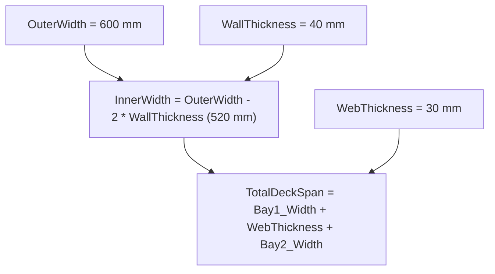

# Parametric 2D CAD Engine — Simple Implementation Guide

Welcome to the simple guide for the **Intelligent Parametric CAD Engine**. This document explains everything built in the system using simple, plain-English terms without complicated academic jargon.

---

## 1. The Big Picture: What Does This System Do?

In regular drawing apps, shapes are just dumb colored pixels or lines on a screen. If you draw a box inside another box, the app has no idea that the gap is a wall, or that making the inner box bigger means the wall gets thinner.

In this **Intelligent CAD Engine**:
1. **The system understands what you draw**: It looks at shapes, loops, circles, and lines, and automatically detects relationships (like walls, centerlines, gaps, and boundaries).
2. **It writes atomic (small) formulas for you**: You don't have to manually write formulas like `InnerWidth = OuterWidth - 2 * WallThickness`. The system writes them as bite-sized building blocks.
3. **The Chain Rule**: You can take these small building blocks, store them as variables (`WallThickness`, `InnerWidth`), and chain them together to build complex engineering structures (like multi-cell culverts or RCC bridges) with zero headache.
4. **Clean UI Slab**: All inferred formulas live in a clean, uncluttered **AutoFormula** slab on the right sidebar where you can inspect, tweak, or accept them with one click.
5. **Hierarchical Groups & Rigidity**: You can group shapes into nested sub-assemblies. When you move or edit a group, everything inside stays structurally rigid and doesn't break.

---

## 2. The Core Mathematical Formulas (In Simple Terms)

Here is how the math works under the hood for each feature:

### A. Automatic Wall Thickness & Insets (The Offset Rule)
When you draw an inner shape inside an outer shape (or a closed loop of lines inside a frame):
1. The engine calculates the 4 clearances:
   - Left clearance: $t_L = \text{Inner Left} - \text{Outer Left}$
   - Right clearance: $t_R = \text{Outer Right} - \text{Inner Right}$
   - Top clearance: $t_T = \text{Inner Top} - \text{Outer Top}$
   - Bottom clearance: $t_B = \text{Outer Bottom} - \text{Inner Bottom}$
2. If all four clearances are roughly the same, the engine declares a **Uniform Wall Thickness** $T$:
   $$T = \text{Average}(t_L, t_R, t_T, t_B)$$
3. It immediately generates the **Atomic Dimension Formulas**:
   $$\text{InnerWidth} = \text{OuterWidth} - 2 \times T$$
   $$\text{InnerHeight} = \text{OuterHeight} - 2 \times T$$
4. And the **Atomic Position Formulas**:
   $$\text{Inner X} = \text{Outer X} + T$$
   $$\text{Inner Y} = \text{Outer Y} + T$$

---

### B. Centering & Symmetry Rule
When an inner shape (or a circle/duct) is placed in the center:
- If Left clearance $\approx$ Right clearance:
  $$\text{Inner X} = \text{Outer X} + \frac{\text{OuterWidth} - \text{InnerWidth}}{2}$$
- For circular pipes / ducts inside a bay:
  $$\text{Duct Center X} = \text{Bay X} + \frac{\text{Bay Width}}{2}$$

---

### C. Partition & Web Spacing Rule (Side-by-Side Shapes)
When two shapes sit next to each other (like two bays of a bridge or two cells of a box culvert):
- The engine measures the gap between them:
  $$\text{WebThickness} = \text{Bay 2 Left} - \text{Bay 1 Right}$$
- It creates the positioning formula:
  $$\text{Bay 2 X} = \text{Bay 1 X} + \text{Bay 1 Width} + \text{WebThickness}$$

---

### D. Concentric Rings & Pipes
When two circles share the same center:
- The engine calculates the radial wall:
  $$\text{WallThickness} = \text{Outer Radius} - \text{Inner Radius}$$
- And creates the radial formula:
  $$\text{Inner Radius} = \text{Outer Radius} - \text{WallThickness}$$

---

### E. Design Boundaries & Span Limits (Safe vs Exceeded)
Every shape or opening has an allowed boundary or span. The engine evaluates:
$$\text{Remaining Space} = \text{Allowed Max Span} - \text{Current Shape Span}$$
- **Safe**: Remaining Space $> 50\text{ px}$.
- **Approaching Limit**: Remaining Space between $0$ and $50\text{ px}$ (yellow warning).
- **At Limit**: Remaining Space $\approx 0\text{ px}$.
- **Exceeded**: Remaining Space $< 0\text{ px}$ (red banner: shape exceeds span).

For non-rectangular boundaries (like a triangle or sloping roof), horizontal ray-intersection finds the exact available width at that specific vertical height:
$$\text{Available Width at Height } Y = X_{\text{right edge}}(Y) - X_{\text{left edge}}(Y)$$

---

## 3. The Atomic Chain Rule: Making Complex Designs Easy

Instead of forcing you to write huge, scary mathematical equations, the system breaks everything down into **small atomic pieces**:

1. **Step 1 (Auto-detected)**: The system suggests atomic formula:
   `InnerWidth = OuterWidth - 2 * WallThickness`
2. **Step 2 (One-Click Store)**: You click **`[+ Store in Variable]`**.
3. **Step 3 (Chain Rule)**: Both `WallThickness` and `InnerWidth` are now permanently saved variables in your symbol table!
4. **Step 4 (Higher-Order Formulas)**: In the Quick Formula Bar or Inspector, you can now freely use them in bigger equations:
   `TotalDeckSpan = Bay1_Width + WebThickness + Bay2_Width`

Zero undefined variable errors, zero guessing, and 100% mathematical precision!

---

## 4. Hierarchical Groups & Structural Rigidity

In CAD drafting, drawings consist of sub-assemblies (e.g., Pier Cap + Column = Pier Assembly; Pier Assembly + Footing = Entire Pier Substructure).

- **Nested Groups**: You can group elements, and then group those groups inside larger groups.
- **Structural Rigidity**: When you drag, move, or rotate a group, all child components move together as a rigid body. Their relative internal distances never distort or break.
- **Hierarchy Tab**:
  - Shows folder tree of all groups and child shapes.
  - Shows the **Group Origin** and **Total Span** ($W \times H$).
  - One-click Inline Renaming, Lock/Unlock, Show/Hide, and Ungrouping.

---

## 5. Summary of Where to Find Things in the UI

| UI Element | Location | What It Does |
| :--- | :--- | :--- |
| **AutoFormula Tab** | Right Sidebar (`🔗 AutoFormula`) | Clean, uncluttered slab showing all detected atomic formulas, values breakdown, and 1-click **Store in Variable** button. |
| **Hierarchy Tab** | Right Sidebar (`📁 Hierarchy`) | Tree view of all nested groups, group bounding span, lock toggles, and rigidity controls. |
| **Quick Formula Bar** | Bottom Bar (`f(x) Quick Formula`) | Type chained formulas like `clear_span = 500, wall_thickness = 30` or click pre-built CAD benchmarks (Culvert 1-Cell, Culvert 2-Span, RCC Bridge). |
| **Boundary Limit Banners** | On-Canvas Overlays | Live colored banners that warn you if a shape is approaching or exceeding its maximum boundary. |

Everything is built on a single, unified dependency graph (DAG) where changes to any variable automatically ripple through the geometry instantly.
