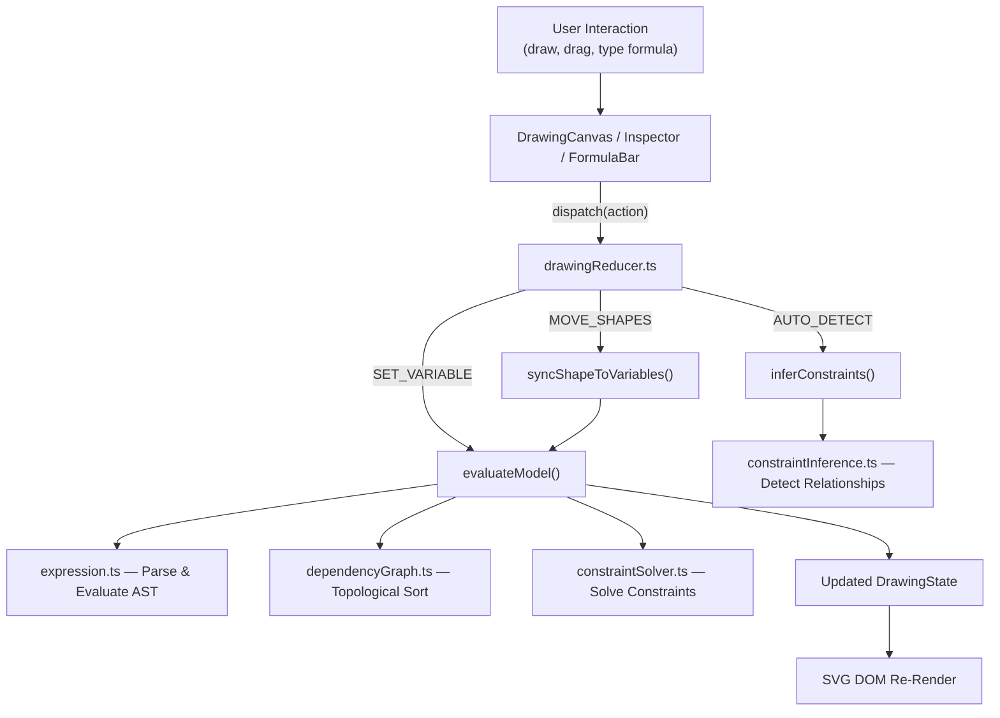
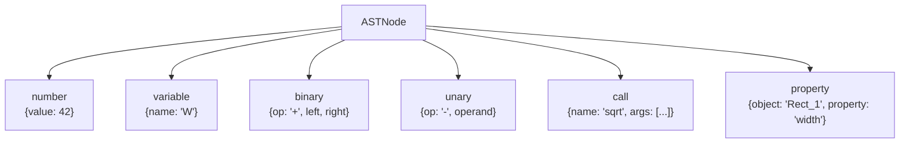
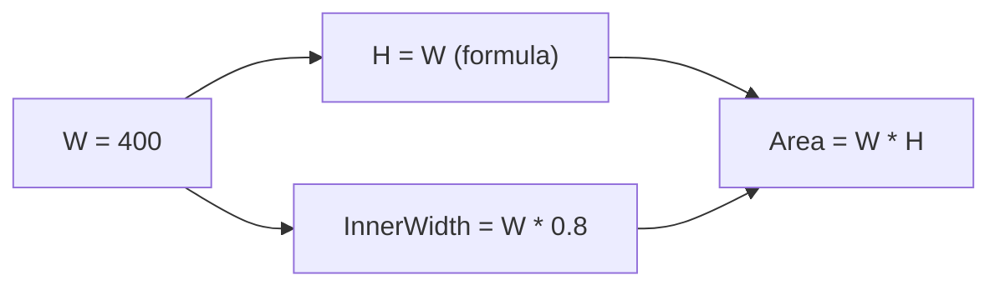
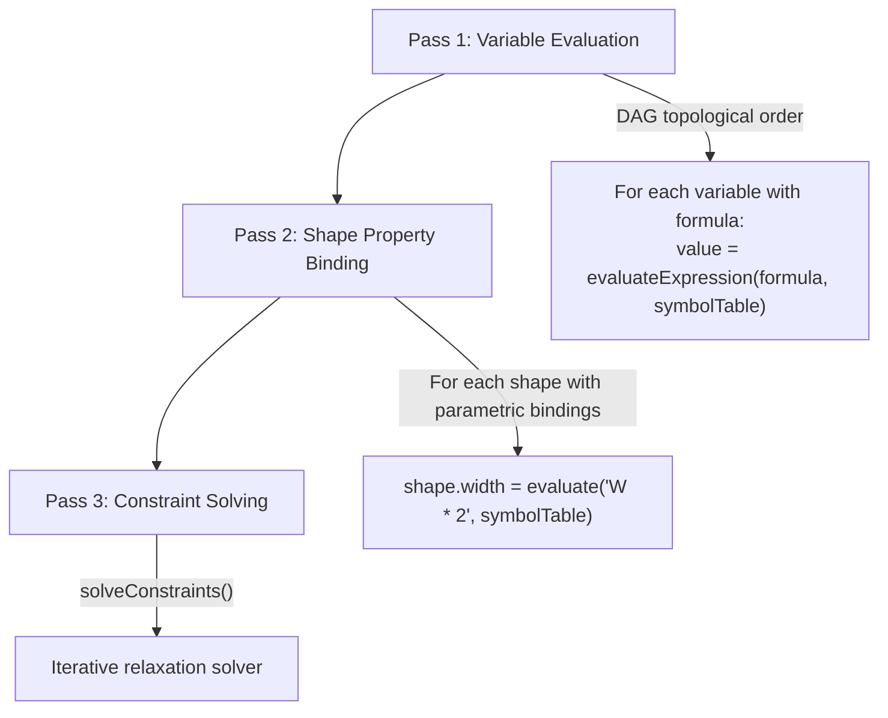
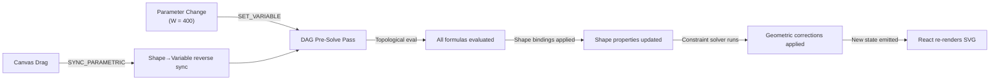

# 2D Canvas Studio — Complete Codebase Deep Dive

> **Everything that happens under the hood**: AutoFormula, Parameters, Geometry, Constraint Solver, Inference Engine, and every mathematical formula used.

---

## Table of Contents

1. [Architecture Overview](#1-architecture-overview)
2. [Geometry Engine (`lib/geometry/`)](#2-geometry-engine)
3. [Expression System & AST (`lib/parametric/expression.ts`)](#3-expression-system--ast)
4. [Dependency Graph / DAG (`lib/parametric/dependencyGraph.ts`)](#4-dependency-graph--dag)
5. [Parametric Model & AutoFormula (`lib/parametric/model.ts`)](#5-parametric-model--autoformula)
6. [Geometric Constraints (`lib/parametric/constraints.ts`)](#6-geometric-constraints)
7. [Constraint Solver (`lib/solver/constraintSolver.ts`)](#7-constraint-solver)
8. [Constraint Inference Engine (`lib/inference/constraintInference.ts`)](#8-constraint-inference-engine)
9. [CAD Templates (`lib/parametric/templates.ts`)](#9-cad-templates)
10. [State Management & Bidirectional Sync](#10-state-management--bidirectional-sync)
11. [Canvas Rendering Pipeline](#11-canvas-rendering-pipeline)
12. [Complete Formula Reference](#12-complete-formula-reference)

---

## 1. Architecture Overview

The application is a **Parametric 2D CAD Geometry Workspace** built with Next.js, React, TypeScript, and raw SVG DOM — **zero external drawing libraries**. It is organized into three tiers:

```
┌───────────────────────────────────────────────────────────────────┐
│                    UI Layer (features/)                           │
│   Canvas · Inspector · Toolbar · StatusBar · Parametric Panels    │
├───────────────────────────────────────────────────────────────────┤
│                 State Layer (lib/state/)                          │
│   drawingReducer.ts  ←→  drawingContext.tsx                       │
│   (100-step undo/redo history · pure reducer · React context)     │
├───────────────────────────────────────────────────────────────────┤
│             Pure Math Kernel (lib/)                               │
│   geometry/   parametric/   solver/   inference/   serialization/ │
│   (Zero DOM · Zero React · 100% mathematical functions)           │
└───────────────────────────────────────────────────────────────────┘
```

### Data Flow Pipeline



### The Dual-Direction Sync

| Direction | Trigger | What Happens |
|---|---|---|
| **Parameters → Canvas** | User types `W = 400` in formula bar | DAG evaluates formulas → updates shape properties → SVG re-renders |
| **Canvas → Parameters** | User drags a shape on canvas | Shape coordinates update → exposed variables sync to new values → DAG re-evaluates dependents |

---

## 2. Geometry Engine

> **Location**: [lib/geometry/](file:///Users/proximus/Documents/Aagento%20Systems/2D%20Canvas/lib/geometry)
> **Purpose**: Pure mathematical functions — zero DOM, zero React. The foundational math layer.

### 2.1 Types ([types.ts](file:///Users/proximus/Documents/Aagento%20Systems/2D%20Canvas/lib/geometry/types.ts))

The single source of truth for all data structures in the application.

#### Shape Types (discriminated union)
| Type | Extra Properties | Description |
|---|---|---|
| `line` | `x2, y2, points?` | Segment between two endpoints |
| `arrow` | `x2, y2, headSize?` | Line with arrowhead |
| `rect` | — | Axis-aligned rectangle |
| `circle` | `rx?, ry?` | Circle (width = height = diameter) |
| `ellipse` | — | Ellipse (independent rx, ry) |
| `polygon` | `sides, points?, regularSides?` | Regular polygon (3–12 sides) |
| `star` | `points_count, innerRadius` | Star with outer/inner radii |

All shapes share a common base:
```
id · type · x · y · width · height · rotation
stroke · fill · strokeWidth · opacity · name
groupId? · locked? · visible? · parametric?
localCoordinateSystem? { originX, originY, angle, parentId }
```

#### Parametric Bindings
```typescript
parametric?: Record<string, string>  // property name → formula expression
// Example: { width: "W * 2", height: "W" }
```

#### Snap Types
8 distinct snap targets: `ENDPOINT` · `CORNER` · `MIDPOINT` · `CENTROID` · `EDGE` · `INTERSECTION` · `PERPENDICULAR` · `GRID`

#### Constraint Types
14 constraint types: `horizontal` · `vertical` · `parallel` · `perpendicular` · `equal_length` · `fixed_length` · `concentric` · `tangent` · `symmetric` · `collinear` · `fixed_angle` · `aspect_ratio` · `midpoint_on` · `point_on_line`

---

### 2.2 Metrics ([metrics.ts](file:///Users/proximus/Documents/Aagento%20Systems/2D%20Canvas/lib/geometry/metrics.ts))

All measurement, vertex generation, and centroid calculation functions.

#### Line Metrics

$$L = \sqrt{(x_2 - x_1)^2 + (y_2 - y_1)^2}$$

$$\theta = \text{atan2}(y_2 - y_1,\; x_2 - x_1) \times \frac{180}{\pi}$$

$$M = \left(\frac{x_1 + x_2}{2},\; \frac{y_1 + y_2}{2}\right)$$

#### Polygon Vertex Generation

Each vertex of a regular $n$-sided polygon centered at $(cx, cy)$ with circumradius $R$ and rotation $\theta$:

$$V_i = \left(cx + R\cos\!\left(\frac{2\pi i}{n} + \theta - \frac{\pi}{2}\right),\;\; cy + R\sin\!\left(\frac{2\pi i}{n} + \theta - \frac{\pi}{2}\right)\right)$$

The $-\pi/2$ offset starts the first vertex at the top (12 o'clock).

#### Star Vertex Generation

Alternates between outer radius $R_{out}$ and inner radius $R_{in}$ for $n$ points:

$$V_{2i} = \left(cx + R_{out}\cos\!\left(\frac{2\pi i}{n} - \frac{\pi}{2}\right),\;\; cy + R_{out}\sin\!\left(\frac{2\pi i}{n} - \frac{\pi}{2}\right)\right)$$

$$V_{2i+1} = \left(cx + R_{in}\cos\!\left(\frac{2\pi i}{n} + \frac{\pi}{n} - \frac{\pi}{2}\right),\;\; cy + R_{in}\sin\!\left(\frac{2\pi i}{n} + \frac{\pi}{n} - \frac{\pi}{2}\right)\right)$$

#### Shape Metrics (by type)

| Shape | Area | Perimeter | Centroid |
|---|---|---|---|
| **Rectangle** | $W \times H$ | $2(W + H)$ | $(x + W/2,\; y + H/2)$ |
| **Circle** | $\pi r^2$ where $r = W/2$ | $2\pi r$ | Center |
| **Ellipse** | $\pi r_x r_y$ | Ramanujan I: $\pi\left[3(r_x + r_y) - \sqrt{(3r_x + r_y)(r_x + 3r_y)}\right]$ | Center |
| **Polygon** | Shoelace formula (below) | Sum of edge lengths | Green's theorem (below) |
| **Star** | Shoelace formula | Sum of edge lengths | Green's theorem |
| **Line** | 0 | Length $L$ | Midpoint |

#### Shoelace Formula (Polygon Area)

For $N$ vertices $(x_0, y_0), \ldots, (x_{N-1}, y_{N-1})$ with $x_N = x_0$, $y_N = y_0$:

$$A = \frac{1}{2}\left|\sum_{i=0}^{N-1}(x_i\,y_{i+1} - x_{i+1}\,y_i)\right|$$

#### Green's Theorem Centroid

$$C_x = \frac{1}{6A}\sum_{i=0}^{N-1}(x_i + x_{i+1})(x_i\,y_{i+1} - x_{i+1}\,y_i)$$

$$C_y = \frac{1}{6A}\sum_{i=0}^{N-1}(y_i + y_{i+1})(x_i\,y_{i+1} - x_{i+1}\,y_i)$$

---

### 2.3 Hit Testing ([hitTest.ts](file:///Users/proximus/Documents/Aagento%20Systems/2D%20Canvas/lib/geometry/hitTest.ts))

Determines if a cursor point "hits" a shape.

#### Point Rotation (for rotated shapes)

Before testing, the cursor point is **inverse-rotated** around the shape center:

$$x' = \cos(\theta)(p_x - c_x) - \sin(\theta)(p_y - c_y) + c_x$$
$$y' = \sin(\theta)(p_x - c_x) + \cos(\theta)(p_y - c_y) + c_y$$

#### Tests by Shape Type

| Shape | Algorithm | Formula |
|---|---|---|
| **Rectangle** | AABB containment | $x_s \le p_x \le x_s + w$ and $y_s \le p_y \le y_s + h$ |
| **Circle/Ellipse** | Normalized distance | $\left(\frac{\Delta x}{r_x}\right)^2 + \left(\frac{\Delta y}{r_y}\right)^2 \le 1$ |
| **Line/Arrow** | Parametric projection | $t = \frac{(\mathbf{P}-\mathbf{A})\cdot(\mathbf{B}-\mathbf{A})}{\|\mathbf{B}-\mathbf{A}\|^2}$, clamped to $[0,1]$; distance $\le$ tolerance |
| **Polygon/Star** | Ray-casting | Cast horizontal ray, count boundary crossings; odd = inside |

---

### 2.4 Coordinate Transforms ([transform.ts](file:///Users/proximus/Documents/Aagento%20Systems/2D%20Canvas/lib/geometry/transform.ts))

Converts between screen (pixel) space and canvas (SVG) space.

#### Screen → SVG

$$x_{svg} = \frac{x_{screen} - pan_x}{zoom}$$
$$y_{svg} = \frac{y_{screen} - pan_y}{zoom}$$

#### SVG → Screen

$$x_{screen} = x_{svg} \times zoom + pan_x$$
$$y_{screen} = y_{svg} \times zoom + pan_y$$

#### Cursor-Anchored Zoom

When zooming at cursor position $(s_x, s_y)$ to new zoom level $z'$:
1. Convert cursor to SVG: $p_{svg} = \text{screenToSvg}(s_x, s_y)$
2. Recompute pan so $p_{svg}$ stays fixed under cursor:

$$pan_x' = s_x - p_{svg_x} \times z'$$
$$pan_y' = s_y - p_{svg_y} \times z'$$

---

### 2.5 Snapping Engine ([snapping.ts](file:///Users/proximus/Documents/Aagento%20Systems/2D%20Canvas/lib/geometry/snapping.ts))

CAD-grade magnetic snapping with 8 target types and intersection detection.

#### Snap Target Generation

| Shape | Generated Targets |
|---|---|
| **Rectangle** | 4 corners + 4 edge midpoints + 1 centroid (9 total) |
| **Circle/Ellipse** | Center + 4 quadrant points (5 total) |
| **Line/Arrow** | 2 endpoints + 1 midpoint (3 total) |
| **Polygon/Star** | All vertices + 1 centroid |

#### Snap Resolution Priority

1. Find closest shape snap target within threshold distance
2. If none found, snap to grid: $x_{snap} = \text{round}(x / g) \times g$

#### Line-Line Intersection

Using parametric intersection via 2D cross products:

$$\mathbf{d_1} = \mathbf{B} - \mathbf{A}, \quad \mathbf{d_2} = \mathbf{D} - \mathbf{C}$$
$$t = \frac{(\mathbf{C} - \mathbf{A}) \times \mathbf{d_2}}{\mathbf{d_1} \times \mathbf{d_2}}$$

Where the 2D cross product: $\mathbf{u} \times \mathbf{v} = u_x v_y - u_y v_x$

Intersection exists if $0 \le t \le 1$ and $0 \le s \le 1$.

#### Perpendicular Snap

Projects cursor point $\mathbf{P}$ onto line segment $\overline{AB}$:

$$t = \frac{(\mathbf{P} - \mathbf{A}) \cdot (\mathbf{B} - \mathbf{A})}{\|\mathbf{B} - \mathbf{A}\|^2}$$

Foot of perpendicular: $\mathbf{F} = \mathbf{A} + t(\mathbf{B} - \mathbf{A})$

---

## 3. Expression System & AST

> **File**: [expression.ts](file:///Users/proximus/Documents/Aagento%20Systems/2D%20Canvas/lib/parametric/expression.ts)
> **Purpose**: Tokenize, parse, and evaluate mathematical formula strings into numerical values.

### 3.1 Tokenizer (Lexer)

Scans a string like `"W * 2 + sqrt(H)"` into tokens:

| Token Type | Examples |
|---|---|
| `NUMBER` | `42`, `3.14` |
| `IDENT` | `W`, `H`, `Rectangle_1` |
| `OP` | `+`, `-`, `*`, `/`, `^`, `%` |
| `LPAREN` / `RPAREN` | `(`, `)` |
| `COMMA` | `,` |
| `DOT` | `.` |

### 3.2 AST Parser (Recursive Descent)

Implements operator precedence via recursive descent:

```
parseExpression  →  handles  +, -         (lowest precedence)
  └─ parseTerm   →  handles  *, /, %
      └─ parsePower →  handles  ^          (right-associative)
          └─ parseUnary →  handles  unary -
              └─ parsePrimary →  numbers, variables, function calls, property access, parens
```

#### AST Node Types



### 3.3 Evaluator

Tree-walking interpreter that evaluates the AST against a symbol table:

#### Built-in Math Functions

| Function | Maps To |
|---|---|
| `sqrt(x)` | `Math.sqrt(x)` |
| `sin(x)`, `cos(x)`, `tan(x)` | `Math.sin/cos/tan(x)` |
| `asin(x)`, `acos(x)`, `atan(x)` | `Math.asin/acos/atan(x)` |
| `atan2(y, x)` | `Math.atan2(y, x)` |
| `abs(x)` | `Math.abs(x)` |
| `min(a, b)`, `max(a, b)` | `Math.min/max(a, b)` |
| `round(x)`, `floor(x)`, `ceil(x)` | `Math.round/floor/ceil(x)` |
| `hypot(a, b)` | `Math.hypot(a, b)` |
| `pow(base, exp)` | `Math.pow(base, exp)` |
| `log(x)`, `exp(x)` | `Math.log/exp(x)` |
| `PI` | `3.14159...` |
| `E` | `2.71828...` |

#### Variable Extraction
`extractVariables(ast)` walks the tree and collects all referenced variable names, including dotted property access like `Rectangle_1.width`.

---

## 4. Dependency Graph / DAG

> **File**: [dependencyGraph.ts](file:///Users/proximus/Documents/Aagento%20Systems/2D%20Canvas/lib/parametric/dependencyGraph.ts)
> **Purpose**: Tracks which variables depend on which, detects cycles, and computes evaluation order.

### 4.1 Data Structure

A `DependencyGraph` class with two `Map<string, Set<string>>` adjacency lists:
- **forward**: `A → {B, C}` means "A is used by B and C"
- **backward**: `B → {A}` means "B depends on A"

### 4.2 Cycle Detection — Tarjan-style DFS

Uses 3-color marking:
| Color | Meaning |
|---|---|
| White (0) | Unvisited |
| Gray (1) | In current DFS stack — revisiting = **cycle found** |
| Black (2) | Fully processed |

Returns the cycle path (e.g., `["A", "B", "C", "A"]`) or `null` if acyclic.

### 4.3 Topological Sort — Kahn's Algorithm

1. Compute in-degree for each node
2. Seed queue with zero in-degree nodes
3. Process queue: for each node, decrement in-degree of dependents; enqueue when in-degree reaches 0
4. Result: evaluation order where every variable is evaluated **after** its dependencies

### 4.4 Dirty Propagation

When a variable changes:
1. `getDirtySet(changedNode)` — BFS collects all transitively-dependent nodes
2. `getEvaluationOrder(dirtyNodes)` — Filters topological sort to only the affected subset
3. Only re-evaluates the minimum necessary variables



Changing `W` makes `{H, InnerWidth, Area}` dirty → evaluates in that order.

---

## 5. Parametric Model & AutoFormula

> **File**: [model.ts](file:///Users/proximus/Documents/Aagento%20Systems/2D%20Canvas/lib/parametric/model.ts)
> **Purpose**: The **core parametric engine** — connects variables, formulas, constraints, and geometry. Contains the **AutoFormula detection algorithm**.

### 5.1 Model Evaluation Pipeline

`evaluateModel(model)` runs 3 sequential passes:



### 5.2 Exposed Shape Properties

Each shape type exposes numerical properties that can be parametrically driven:

| Shape | Exposed Properties |
|---|---|
| **All shapes** | `x`, `y`, `width`, `height`, `rotation`, `opacity`, `strokeWidth` |
| **Line/Arrow** | + `x2`, `y2`, `length` ($= \sqrt{(x_2-x)^2 + (y_2-y)^2}$), `angle` ($= \text{atan2} \times 180/\pi$) |
| **Circle** | + `r` (= width/2), `cx`, `cy` |
| **Ellipse** | + `rx`, `ry`, `cx`, `cy` |
| **Polygon** | + `sides` |
| **Star** | + `points_count`, `innerRadius` |

### 5.3 Reverse Sync (Canvas → Parameters)

`syncShapeToVariables(shape, variables)`:
- When a shape is dragged/resized on canvas
- Reads current geometric properties
- Updates matching non-formula variables (e.g., `Rectangle_1.width = 350`)
- Only updates **free** variables (not formula-driven ones)

### 5.4 🌟 AutoFormula Detection Algorithm

`autoFormulaDetection(shapes, existingVariables)` — The intelligence that **automatically writes formulas for you**.

#### Step 1: Containment Detection (Nested Shapes)

For each pair of shapes, checks AABB containment:

```
if inner.x >= outer.x AND inner.y >= outer.y AND
   inner.x + inner.width <= outer.x + outer.width AND
   inner.y + inner.height <= outer.y + outer.height
```

Computes 4 clearances:
$$t_L = \text{inner.x} - \text{outer.x}$$
$$t_R = (\text{outer.x} + \text{outer.width}) - (\text{inner.x} + \text{inner.width})$$
$$t_T = \text{inner.y} - \text{outer.y}$$
$$t_B = (\text{outer.y} + \text{outer.height}) - (\text{inner.y} + \text{inner.height})$$

**If uniform** ($\max - \min < 5\text{px}$): Creates a `WallThickness` variable and formulas:

$$\text{WallThickness} = \frac{t_L + t_R + t_T + t_B}{4}$$
$$\text{InnerWidth} = \text{OuterWidth} - 2 \times \text{WallThickness}$$
$$\text{InnerHeight} = \text{OuterHeight} - 2 \times \text{WallThickness}$$
$$\text{InnerX} = \text{OuterX} + \text{WallThickness}$$
$$\text{InnerY} = \text{OuterY} + \text{WallThickness}$$

**If centered** ($|t_L - t_R| < 5$):

$$\text{InnerX} = \text{OuterX} + \frac{\text{OuterWidth} - \text{InnerWidth}}{2}$$

#### Step 2: Adjacency Detection (Side-by-Side Shapes)

For shapes at similar Y positions ($|\Delta y| < 5$):

$$\text{gap} = \text{shape2.x} - (\text{shape1.x} + \text{shape1.width})$$

If $0 < \text{gap} < 200$: Creates `WebThickness` variable and formula:

$$\text{Shape2X} = \text{Shape1X} + \text{Shape1Width} + \text{WebThickness}$$

If heights match ($|h_1 - h_2| < 5$): Generates `equal_length` constraint.

#### Step 3: Concentric Detection (Shared Centers)

For each pair of circles/ellipses:

$$d = \sqrt{(\Delta cx)^2 + (\Delta cy)^2}$$

If $d < 5$: Creates `WallThickness` = radius difference and formula:

$$\text{InnerRadius} = \text{OuterRadius} - \text{WallThickness}$$

Plus a `concentric` constraint.

#### Step 4: Alignment Detection

For shapes sharing X or Y coordinates (within 5px): generates alignment constraints.

> [!TIP]
> **The Atomic Chain Rule**: AutoFormula breaks complex engineering relationships into small, composable building blocks. You store individual pieces as named variables, then chain them into higher-order formulas like `TotalSpan = Bay1Width + WebThickness + Bay2Width`.

---

## 6. Geometric Constraints

> **File**: [constraints.ts](file:///Users/proximus/Documents/Aagento%20Systems/2D%20Canvas/lib/parametric/constraints.ts)
> **Purpose**: Defines all 14 constraint types with their residual equations and geometric projection functions.

### 6.1 Constraint Registry

Every constraint has three components:
- **Residual function** $f(\mathbf{X})$ — measures violation (should be 0 when satisfied)
- **Projection function** — applies a geometric correction to reduce the residual
- **DOF impact** — how many degrees of freedom it removes

### 6.2 All Constraints (with formulas)

---

#### Horizontal
> Forces a line/edge to be horizontal.

**Residual**: $f = |y_2 - y_1|$

**Projection**: $y_{mid} = \frac{y_1 + y_2}{2}$, set both endpoints to $y_{mid}$

**DOF**: removes 1

---

#### Vertical
> Forces a line/edge to be vertical.

**Residual**: $f = |x_2 - x_1|$

**Projection**: $x_{mid} = \frac{x_1 + x_2}{2}$, set both endpoints to $x_{mid}$

**DOF**: removes 1

---

#### Parallel
> Forces two line segments to have the same direction.

**Residual** (cross product — zero for parallel):

$$f = |d_{1x} \cdot d_{2y} - d_{1y} \cdot d_{2x}|$$

**Projection**: Rotate line 2's endpoint to match line 1's angle, preserving length:

$$\theta_1 = \text{atan2}(d_{1y}, d_{1x})$$
$$x_4' = x_3 + L_2 \cos(\theta_1)$$
$$y_4' = y_3 + L_2 \sin(\theta_1)$$

**DOF**: removes 2

---

#### Perpendicular
> Forces two line segments to be at right angles.

**Residual** (dot product — zero for perpendicular):

$$f = |d_{1x} \cdot d_{2x} + d_{1y} \cdot d_{2y}|$$

**Projection**: Rotate line 2 to $\theta_1 + \frac{\pi}{2}$:

$$x_4' = x_3 + L_2 \cos\!\left(\theta_1 + \frac{\pi}{2}\right)$$
$$y_4' = y_3 + L_2 \sin\!\left(\theta_1 + \frac{\pi}{2}\right)$$

**DOF**: removes 2

---

#### Equal Length
> Forces two segments/shapes to have the same dimension.

**Residual**: $f = |L_1 - L_2|$

**Projection**: Scale line 2 from its midpoint so $L_2 = L_1$:

$$\text{scale} = \frac{L_1}{L_2}$$

**DOF**: removes 2

---

#### Fixed Length
> Locks a segment/dimension to a specific value $L_0$.

**Residual**: $f = |L_{current} - L_0|$

**Projection**: Scale from midpoint to target length.

**DOF**: removes 1

---

#### Concentric
> Forces two shapes to share the same center.

**Residual**: $f = \sqrt{(\Delta cx)^2 + (\Delta cy)^2}$

**Projection**: Translate shape 2 so its center coincides with shape 1's center:

$$x_2' = cx_1 - w_2/2, \quad y_2' = cy_1 - h_2/2$$

**DOF**: removes 2

---

#### Fixed Angle
> Locks a line's angle to a specific value $\theta_0$.

**Residual**: $f = |\theta_{current} - \theta_0|$

**Projection**: Rotate endpoint around start:

$$x_2' = x_1 + L\cos(\theta_0), \quad y_2' = y_1 + L\sin(\theta_0)$$

**DOF**: removes 1

---

#### Aspect Ratio
> Forces $H = W / k$ for a given ratio $k$.

**Residual**: $f = |H - W/k|$

**Projection**: Set $H' = W / k$

**DOF**: removes 1

---

#### Tangent
> Forces a line to be tangent to a circle.

**Residual**: $f = |d_\perp - r|$

Where $d_\perp$ is the perpendicular distance from circle center to the line (computed via parametric projection).

**DOF**: removes 2

---

#### Symmetric
> Forces two shapes to be mirror images about a vertical axis.

**Residual**: $f = |cx_1 + cx_2 - 2x_{mid}|$

Also enforces matching Y, width, and height.

**DOF**: removes 2

---

#### Collinear
> Forces three points to lie on a single line.

**Residual** (area of triangle formed by 3 points):

$$f = |(B_x - A_x)(C_y - A_y) - (B_y - A_y)(C_x - A_x)|$$

**Projection**: Project point C onto line $\overline{AB}$.

**DOF**: removes 2

---

#### Midpoint On / Point on Line
> Forces a point to lie on a line or shape.

**Residual**: Perpendicular distance from point to target.

**Projection**: Project point onto the target.

**DOF**: removes 1–2

---

## 7. Constraint Solver

> **File**: [constraintSolver.ts](file:///Users/proximus/Documents/Aagento%20Systems/2D%20Canvas/lib/solver/constraintSolver.ts)
> **Purpose**: Iterative relaxation solver that satisfies geometric constraints simultaneously.

### 7.1 Solver Configuration

| Parameter | Default | Meaning |
|---|---|---|
| `maxIterations` | 50 | Maximum solver cycles |
| `tolerance` | 0.01 px | Convergence threshold |
| `relaxationFactor` | 0.6 | Under-relaxation (prevents oscillation) |
| `priorityLevels` | 3 | Number of priority tiers |

### 7.2 Algorithm: Priority-Layered Gauss-Seidel Relaxation

```
┌─────────────────────────────────────────────────┐
│  1. Clone shapes into mutable working copies    │
│  2. Sort constraints by priority (ascending)    │
│  3. Group constraints by priority level         │
│                                                 │
│  FOR each priority level:                       │
│    FOR iteration = 0 to maxIterations:          │
│      maxResidual = 0                            │
│      FOR each constraint in this level:         │
│        residual = evaluateResidual(constraint)  │
│        IF residual > tolerance:                 │
│          correction = projectConstraint()       │
│          shapes += correction × 0.6             │  ← Under-relaxation
│          maxResidual = max(maxResidual, residual)│
│      IF maxResidual < tolerance → BREAK         │  ← Converged!
│                                                 │
│  4. Compute shape deltas (original vs solved)   │
│  5. Generate diagnostics per constraint         │
│  6. Return SolverResult                         │
└─────────────────────────────────────────────────┘
```

> [!IMPORTANT]
> **Under-relaxation factor (0.6)**: Each correction applies only 60% of the computed delta. This prevents two conflicting constraints from "fighting" — oscillating between opposing corrections indefinitely.

### 7.3 Constraint Diagnostics

Each constraint is classified post-solve:

| Status | Meaning |
|---|---|
| `satisfied` | Residual $\le$ tolerance (green glyph) |
| `active` | Residual decreasing but not yet converged (yellow glyph) |
| `conflicting` | Residual won't decrease — contradictory constraints (red glyph) |

### 7.4 Degree of Freedom Calculation

$$\text{DOF} = 2V - C_{effective}$$

Where:
- $V$ = number of geometric entities (shapes)
- $C_{effective}$ = sum of DOFs removed by each constraint

| Constraint Type | DOFs Removed |
|---|---|
| horizontal, vertical, fixed_length, fixed_angle, aspect_ratio | **1** |
| concentric, equal_length, parallel, perpendicular, tangent, symmetric, collinear | **2** |

---

## 7B. Advanced Variational Solver Layer (Levenberg-Marquardt + SVD)

> **Location**: [lib/solver/](file:///Users/proximus/Documents/Aagento%20Systems/2D%20Canvas/lib/solver)
> **Purpose**: Industrial-grade non-linear least-squares solver using damped Levenberg-Marquardt optimization with Singular Value Decomposition for minimum-norm under-constrained projection.

In addition to the basic Gauss-Seidel relaxation solver, the codebase includes a **full variational numerical kernel** implementing the architecture document's specification.

### 7B.1 Dense Matrix Algebra ([denseMatrix.ts](file:///Users/proximus/Documents/Aagento%20Systems/2D%20Canvas/lib/solver/matrix/denseMatrix.ts))

Uses `Float64Array` for high-performance numerical operations:

| Function | Formula |
|---|---|
| `transpose(A)` | $A^T_{j,i} = A_{i,j}$ |
| `matrixVectorMultiply(A, x)` | $b_i = \sum_{j} A_{i,j} x_j$ |
| `dot(a, b)` | $\langle a, b \rangle = \sum_i a_i b_i$ |
| `norm2(v)` | $\|v\|_2 = \sqrt{\sum_i v_i^2}$ |
| `normInfinity(v)` | $\|v\|_\infty = \max_i |v_i|$ |

### 7B.2 Golub-Reinsch SVD ([svd.ts](file:///Users/proximus/Documents/Aagento%20Systems/2D%20Canvas/lib/solver/matrix/svd.ts))

Full Singular Value Decomposition for arbitrary rectangular matrices: $A = U \Sigma V^T$

**Algorithm Steps:**
1. **Householder Bidiagonalization** — Reduces $A$ to upper bidiagonal form $B$ using reflectors $P_i = I - \frac{u_i u_i^T}{h_i}$
2. **Accumulation** — Backwards accumulation of left ($U$) and right ($V$) transformations
3. **Implicit QR Iteration with Wilkinson Shifts** — Diagonalizes via Givens rotations:

$$\text{shift} = f \pm \sqrt{f^2 + 1}$$

Where $f$ is computed from the trailing $2 \times 2$ bidiagonal block eigenvalues.

4. **Descending Sort** — Orders singular values $\sigma_0 \ge \sigma_1 \ge \ldots \ge 0$

**Overflow-safe hypotenuse**:

$$\text{pythag}(a, b) = |a|\sqrt{1 + (b/a)^2} \quad \text{if } |a| > |b|$$

**Under-determined systems** ($m < n$): Uses transpose duality — $A = V_{A^T} \Sigma^T U_{A^T}^T$

**Constants**: convergence $\epsilon = 10^{-15}$, max 60 QR iterations per singular value.

### 7B.3 Moore-Penrose Pseudo-Inverse ([pseudoInverse.ts](file:///Users/proximus/Documents/Aagento%20Systems/2D%20Canvas/lib/solver/matrix/pseudoInverse.ts))

Computes the generalized inverse $A^+ = V \Sigma^+ U^T$:

$$\Sigma^+_{l,l} = \begin{cases} 1/\sigma_l & \text{if } \sigma_l > \epsilon_{sing} \\ 0 & \text{otherwise} \end{cases}$$

**Minimum-norm step** (without constructing full $A^+$):

$$\Delta X^* = -V \Sigma^+ U^T F$$

This minimizes $\|\Delta X\|_2^2$ subject to satisfying all constraints — geometry not coupled to the modified dimension stays stationary.

### 7B.4 Analytical Jacobians ([analyticalJacobians.ts](file:///Users/proximus/Documents/Aagento%20Systems/2D%20Canvas/lib/solver/jacobians/analyticalJacobians.ts))

Exact closed-form partial derivatives for 9 constraint types. State vector convention: Point $i$ at indices $X[2i], X[2i+1]$.

#### Coincident Constraint
$$F_0 = x_A - x_B, \quad F_1 = y_A - y_B$$
$$\frac{\partial F_0}{\partial x_A} = +1, \quad \frac{\partial F_0}{\partial x_B} = -1$$

#### Distance/Length Constraint
$$F_0 = \sqrt{\Delta x^2 + \Delta y^2} - d_{target}$$
$$\frac{\partial F_0}{\partial x_A} = -\frac{\Delta x}{dist}, \quad \frac{\partial F_0}{\partial x_B} = +\frac{\Delta x}{dist}$$

#### Point-on-Line Constraint
$$F_0 = (x_P - x_1)(y_2 - y_1) - (y_P - y_1)(x_2 - x_1)$$
$$\frac{\partial F_0}{\partial x_P} = \Delta y_{21}, \quad \frac{\partial F_0}{\partial y_P} = -\Delta x_{21}$$

#### Parallel Constraint (full 4-point Jacobian)
$$F_0 = (x_2 - x_1)(y_4 - y_3) - (y_2 - y_1)(x_4 - x_3)$$

8 non-zero partial derivatives covering all 4 points.

#### Haunch 45° Invariant
$$F_0 = (x_B - x_A) - s_x \cdot h_{target}, \quad F_1 = (y_B - y_A) - s_y \cdot h_{target}$$

Where $s_x, s_y \in \{-1, +1\}$ encode the haunch's corner orientation.

#### Wall Thickness Offset
Perpendicular distance from point $P_3$ to baseline $P_1 \to P_2$ equals target thickness $t$:

$$F_0 = \frac{(x_3 - x_1)(y_2 - y_1) - (y_3 - y_1)(x_2 - x_1)}{L} - t$$

Uses quotient rule for exact Jacobian: $\frac{\partial(N/L)}{\partial X_k} = \frac{\frac{\partial N}{\partial X_k} L - N \frac{\partial L}{\partial X_k}}{L^2}$

#### Numerical Verification ([finiteDifference.ts](file:///Users/proximus/Documents/Aagento%20Systems/2D%20Canvas/lib/solver/jacobians/finiteDifference.ts))

Central difference verification: $J_{i,j} \approx \frac{F_i(X + h e_j) - F_i(X - h e_j)}{2h}$ with $h = 10^{-6}$, truncation error $O(h^2)$.

### 7B.5 Levenberg-Marquardt Solver ([levenbergMarquardt.ts](file:///Users/proximus/Documents/Aagento%20Systems/2D%20Canvas/lib/solver/levenbergMarquardt.ts))

**Core optimization**: Finds $X$ such that $\|F(X)\|^2$ is minimized.

**SVD-Regularized Step:**

$$\Delta X = -V \left(\Sigma^T \Sigma + \lambda I\right)^{-1} \Sigma^T U^T F$$

For each singular value $\sigma_l$:

$$\text{temp}_l = -\left(\sum_j U_{j,l} F_j\right) \cdot \frac{\sigma_l}{\sigma_l^2 + \lambda}$$

**Trust-Region Gain Ratio:**

$$\rho = \frac{\|F(X)\|^2 - \|F(X_{trial})\|^2}{\Delta X^T(\lambda \Delta X - J^T F)}$$

**Damping Adaptation:**
- $\rho > 0.75$ (excellent): $\lambda \leftarrow \max(\lambda / 3, 10^{-12})$
- $\rho < 0.25$ (marginal): $\lambda \leftarrow 2\lambda$
- $\rho \le 0$ (rejected): $\lambda \leftarrow 4\lambda$, reject step
- $\lambda > 10^{12}$: abort (stagnated)

**Convergence**: $\|F\|_\infty < 10^{-8}$ or $\|\Delta X\|_2 < 10^{-8}$

### 7B.6 Chirality / Hysteresis Validation ([hysteresis.ts](file:///Users/proximus/Documents/Aagento%20Systems/2D%20Canvas/lib/solver/hysteresis.ts))

Prevents polygon inversion during large solver steps by checking signed cross products at each vertex:

$$\tau = (V_i - V_{prev}) \times (V_{next} - V_i)$$

If $|\tau_{initial}| > 10^{-4}$ and $\tau_{initial} \cdot \tau_{trial} < 0$ → **chirality inverted**, step rejected.

---

## 7C. Planar Map Topology (DCEL)

> **Location**: [lib/geometry/topology/](file:///Users/proximus/Documents/Aagento%20Systems/2D%20Canvas/lib/geometry/topology)

### DCEL Data Structure

| Entity | Fields |
|---|---|
| `DcelVertex` | `id`, `point: Point2D`, `incidentHalfEdge` |
| `DcelHalfEdge` | `origin`, `target`, `twin`, `next`, `prev`, `face`, `edge`, `angle` |
| `DcelEdge` | `id`, `halfEdge` |
| `DcelFace` | `outerBoundary`, `innerHoles[]`, `area`, `isExterior` |

### $O(1)$ Spatial Hash Vertex Welding ([spatialHash.ts](file:///Users/proximus/Documents/Aagento%20Systems/2D%20Canvas/lib/geometry/topology/spatialHash.ts))

Grid key: $\left(\lfloor x / cellSize \rfloor, \lfloor y / cellSize \rfloor\right)$

9-neighbor lookup within tolerance $\epsilon$. Welds coincident endpoints into single topological vertices.

### DCEL Construction ([dcel.ts](file:///Users/proximus/Documents/Aagento%20Systems/2D%20Canvas/lib/geometry/topology/dcel.ts))

1. **Weld endpoints** via spatial hash
2. **Create twin half-edges** with polar angles: $\theta = \text{atan2}(\Delta y, \Delta x)$
3. **Radial cyclic sort** — outgoing half-edges at each vertex sorted CCW by $\theta$
4. **Link cycle pointers**: $\text{next}(\text{twin}(h_i)) = h_{(i-1+k) \bmod k}$
5. **Extract faces** via cycle traversal

### Face Classification ([cycleExtractor.ts](file:///Users/proximus/Documents/Aagento%20Systems/2D%20Canvas/lib/geometry/topology/cycleExtractor.ts))

- **Signed area > 0 (CCW)** → Solid interior face
- **Signed area < 0 (CW)** → Hole or exterior face
- Holes nested into parent faces via ray-casting containment test

### Hole Nesting ([holeNesting.ts](file:///Users/proximus/Documents/Aagento%20Systems/2D%20Canvas/lib/geometry/topology/holeNesting.ts))

Jordan ray-casting even-odd rule to determine which solid face contains each CW hole cycle.

---

## 7D. Affine Hierarchy & Local Coordinate Systems

> **Location**: [lib/geometry/lcs/](file:///Users/proximus/Documents/Aagento%20Systems/2D%20Canvas/lib/geometry/lcs)

### 3×3 Homogeneous Affine Matrix ([affineMatrix.ts](file:///Users/proximus/Documents/Aagento%20Systems/2D%20Canvas/lib/geometry/lcs/affineMatrix.ts))

$$M = \begin{bmatrix} u_x & v_x & x_0 \\ u_y & v_y & y_0 \\ 0 & 0 & 1 \end{bmatrix}$$

| Factory | Matrix |
|---|---|
| `identity()` | $I_{3\times3}$ |
| `translation(tx, ty)` | $\begin{bmatrix}1&0&tx\\0&1&ty\\0&0&1\end{bmatrix}$ |
| `rotation(θ)` | $\begin{bmatrix}\cos\theta&-\sin\theta&0\\\sin\theta&\cos\theta&0\\0&0&1\end{bmatrix}$ |

**Rigid inverse** (avoids general matrix inversion):

$$M^{-1} = \begin{bmatrix} u_x & u_y & -(u_x x_0 + u_y y_0) \\ v_x & v_y & -(v_x x_0 + v_y y_0) \\ 0 & 0 & 1 \end{bmatrix}$$

### Gram-Schmidt Orthonormalization ([gramSchmidt.ts](file:///Users/proximus/Documents/Aagento%20Systems/2D%20Canvas/lib/geometry/lcs/gramSchmidt.ts))

Given guide vector $\mathbf{w}$:

$$\hat{u} = \frac{\mathbf{w}}{\|\mathbf{w}\|}, \quad \hat{v} = (-\hat{u}_y, \hat{u}_x)$$

Guarantees $\hat{u} \cdot \hat{v} = 0$, $\|\hat{u}\| = \|\hat{v}\| = 1$.

### Scene-Graph Frames ([frame.ts](file:///Users/proximus/Documents/Aagento%20Systems/2D%20Canvas/lib/geometry/lcs/frame.ts))

Hierarchical `LocalFrame` with recursive chain composition:

$$M_{world} = M_{parent} \cdot M_{local} = M_{parent} \cdot T(origin) \cdot R(\theta) \cdot S(scale)$$

---

## 7E. Structural Cross-Section Moments

> **File**: [polygonMoments.ts](file:///Users/proximus/Documents/Aagento%20Systems/2D%20Canvas/lib/geometry/metrics/polygonMoments.ts)

### Second Moments of Area (Green's Theorem)

$$I_{xx} = \frac{1}{12}\sum_{i=0}^{N-1}(y_i^2 + y_i y_{i+1} + y_{i+1}^2)(x_i y_{i+1} - x_{i+1} y_i)$$

$$I_{yy} = \frac{1}{12}\sum_{i=0}^{N-1}(x_i^2 + x_i x_{i+1} + x_{i+1}^2)(x_i y_{i+1} - x_{i+1} y_i)$$

### Parallel Axis Theorem (shift to centroid)

$$I_{xx,centroid} = |I_{xx,origin}| - |A| \cdot \bar{y}^2$$

### Composite Sections with Holes

$$A_{net} = A_{outer} - \sum_k A_{hole,k}$$

$$\bar{x}_{net} = \frac{A_{outer}\bar{x}_{outer} - \sum_k A_{hole,k}\bar{x}_{hole,k}}{A_{net}}$$

$$I_{xx,net} = (I_{xx,outer} + A_{outer} d_{y,outer}^2) - \sum_k (I_{xx,hole,k} + A_{hole,k} d_{y,k}^2)$$

---

## 7F. GAD Assembly Engine

> **File**: [gadAssemblyEngine.ts](file:///Users/proximus/Documents/Aagento%20Systems/2D%20Canvas/lib/geometry/gadAssemblyEngine.ts)
> **Purpose**: Recognizes General Arrangement Drawing hierarchical containment structures and variationally propagates dimension changes.

### Assembly Detection Algorithm

1. **Extract candidate regions** — closed shapes + closed line loops with bounding boxes
2. **Build containment tree** — sort by area, find minimal enclosing parent per candidate ($\epsilon = 2\text{px}$ boundary tolerance)
3. **Compute clearances**: $c_{left}, c_{right}, c_{top}, c_{bottom}, c_{mid}, c_{radial}$
4. **Recognize haunches** — 45° chamfers via `recognizeHaunches()` with $\pm 2.5°$ tolerance
5. **Tag structural roles** — outer boundary vs. inner void vs. haunch

### Variational Assembly Solver

When a dimension changes:
1. Compute $\Delta W$, $\Delta H$ for the target feature
2. Scale target (preserving haunch geometry)
3. Rigidly shift sibling features by $\Delta W$ to preserve web thickness
4. Traverse up the containment tree, expanding parent frames recursively

---

## 8. Constraint Inference Engine

> **File**: [constraintInference.ts](file:///Users/proximus/Documents/Aagento%20Systems/2D%20Canvas/lib/inference/constraintInference.ts) + [lib/inference/](file:///Users/proximus/Documents/Aagento%20Systems/2D%20Canvas/lib/inference)
> **Purpose**: **Automatically detects** geometric relationships from drawn shapes and proposes constraints without user intervention.

### 8.1 Inference Configuration

| Parameter | Default | Description |
|---|---|---|
| `angleTolerance` | 2° | How close to 0°/90° to trigger H/V |
| `distanceTolerance` | 5 px | Snap distance for coincidence/alignment |
| `lengthTolerance` | 3 px | Tolerance for equal-length detection |

### 8.2 Inference Algorithms

The master function `inferConstraints()` runs **8 sub-algorithms** in parallel:

---

#### Horizontal/Vertical Inference

For each line:
$$\theta = |\text{atan2}(y_2 - y_1, x_2 - x_1)| \text{ (degrees)}$$

- **Horizontal**: $|\theta| < 2°$ or $|180° - \theta| < 2°$
- **Vertical**: $|90° - \theta| < 2°$ or $|270° - \theta| < 2°$
- Confidence: $1.0 - \frac{|\theta_{deviation}|}{2°}$

---

#### Parallel Inference

For each pair of lines, angle between direction vectors:

$$\theta_{between} = \left|\text{atan2}(d_{1x} d_{2y} - d_{1y} d_{2x},\;\; d_{1x} d_{2x} + d_{1y} d_{2y})\right| \times \frac{180}{\pi}$$

Parallel if $\theta_{between} < 2°$ or $|180° - \theta_{between}| < 2°$

---

#### Perpendicular Inference

Same angle calculation; perpendicular if $|90° - \theta_{between}| < 2°$

---

#### Equal Length Inference

$$|L_1 - L_2| < 3\text{px}$$

---

#### Concentric Inference

$$\sqrt{(\Delta cx)^2 + (\Delta cy)^2} < 5\text{px}$$

---

#### Symmetry Inference

Two shapes of the same type are symmetric if:
- Y-aligned: $|cy_1 - cy_2| < 5\text{px}$
- Size match: $|w_1 - w_2| < 3\text{px}$ and $|h_1 - h_2| < 3\text{px}$

---

#### Tangent Inference

Perpendicular distance from circle center to line equals radius:
$$|d_\perp - r| < 5\text{px}$$

---

### 8.3 Classification & Confidence

| Category | Confidence | Meaning |
|---|---|---|
| `geometric_fact` | 0.9–1.0 | Near-certain (e.g., concentric circles <1px offset). Auto-applied. |
| `geometric_inference` | 0.6–0.9 | Likely intentional. Suggested to user with one-click accept. |
| `alignment` | 0.6–0.8 | Spatial alignment. Shown as visual guide overlay. |

### 8.4 Deduplication

After inference, duplicates of existing constraints (same type + same shape IDs) are filtered out to prevent redundancy.

### 8.5 Advanced Inference Sub-Modules

The inference engine includes several specialized sub-modules:

#### Admissibility Filter ([admissibilityFilter.ts](file:///Users/proximus/Documents/Aagento%20Systems/2D%20Canvas/lib/inference/admissibilityFilter.ts))

Before adding any inferred constraint, validates it against the current constraint Jacobian using SVD:

1. Decompose current Jacobian: $J = U \Sigma V^T$
2. Project candidate gradient $\mathbf{g}$ onto row space: $\mathbf{g}_{proj} = V V^T \mathbf{g}$
3. Compute orthogonal residual: $\|\mathbf{g} - \mathbf{g}_{proj}\|_2$
4. If residual $\ge 10^{-6}$ → constraint is **linearly independent** (admissible)
5. If residual $< 10^{-6}$ → constraint is **redundant** (rejected)

This prevents over-constraining the drawing.

#### Haunch Recognizer ([haunchRecognizer.ts](file:///Users/proximus/Documents/Aagento%20Systems/2D%20Canvas/lib/inference/haunchRecognizer.ts))

Detects 45° corner chamfers in polygon loops:

$$\theta_{deg} = \text{atan2}(|\Delta y|, |\Delta x|) \cdot \frac{180}{\pi}$$

Chamfer condition: $|\theta_{deg} - 45°| \le 2.5°$

Leg length: $\frac{|\Delta x| + |\Delta y|}{2}$

#### Wall Thickness Extractor ([wallThicknessExtractor.ts](file:///Users/proximus/Documents/Aagento%20Systems/2D%20Canvas/lib/inference/wallThicknessExtractor.ts))

Detects parallel segment pairs and measures perpendicular wall thickness:

1. Compute segment angles $\theta_o$, $\theta_i$
2. Check parallelism: $\Delta\theta \le 2°$
3. Compute perpendicular distance: $d = \frac{|(p_{inner} - p_{outer}) \times \hat{u}_{outer}|}{L_{outer}}$
4. Valid if $5 \le d \le 200$ px

#### Formula Synthesizer ([formulaSynthesizer.ts](file:///Users/proximus/Documents/Aagento%20Systems/2D%20Canvas/lib/inference/formulaSynthesizer.ts))

The **autonomous formula generation engine** — runs 5 detection pipelines:

1. **GAD Assembly Formulas** — From detected containment hierarchies
2. **General Containment** — 4-way clearance statistical analysis ($\sigma < 3.5$px for uniform detection)
3. **Concentric Radial** — Circle-pair center distance $< 3$px
4. **Duct-in-Bay Centering** — Circles inside rectangles with symmetric clearances
5. **Closed Loop Openings** — Complex chamfered voids inside boundaries

Each generates confidence scores ($0.7$ – $0.98$) and chainable parametric expressions.

#### Construction Line Datum ([constructionLine.ts](file:///Users/proximus/Documents/Aagento%20Systems/2D%20Canvas/lib/inference/datum/constructionLine.ts))

Computes virtual infinite-line intersections for datum alignment:

$$t = \frac{(q_1 - p_1) \times \Delta q}{\Delta p \times \Delta q}$$

Enables snapping to extended projection lines and symmetry centerlines.

---

## 9. CAD Templates

> **File**: [templates.ts](file:///Users/proximus/Documents/Aagento%20Systems/2D%20Canvas/lib/parametric/templates.ts)
> **Purpose**: Pre-built parametric models that users can instantiate with adjustable parameters.

### Available Templates

| Template | Category | Parameters | Generated Formula |
|---|---|---|---|
| **Dual-Wall Rectangular Frame** | Structural | `outerWidth`, `outerHeight`, `wallThickness` | $\text{InnerWidth} = \text{OuterWidth} - 2 \times \text{WallThickness}$ |
| **Concentric Tube Profile** | Mechanical | `outerDiameter`, `wallThickness` | $\text{InnerDiameter} = \text{OuterDiameter} - 2 \times \text{WallThickness}$ |
| **Concentric Flange Assembly** | Mechanical | `flangeWidth`, `flangeHeight`, `holeRadius`, `holeInset` | Bolt positions = inset from corners; center hole concentric |

Each template generates shapes, variables, formulas, and constraints as a single atomic unit.

---

## 10. State Management & Bidirectional Sync

> **Files**: [drawingReducer.ts](file:///Users/proximus/Documents/Aagento%20Systems/2D%20Canvas/lib/state/drawingReducer.ts) + [drawingContext.tsx](file:///Users/proximus/Documents/Aagento%20Systems/2D%20Canvas/lib/state/drawingContext.tsx)

### 10.1 State Shape

```typescript
DrawingState {
  shapes: AnyShape[]              // All shapes on canvas
  selectedIds: string[]           // Currently selected shape IDs
  groups: GroupInfo[]              // Nested shape groups
  activeTool: DrawingTool          // Current tool (select/line/rect/...)
  viewport: ViewportState          // Pan + Zoom
  variables: Record<string, ParametricVariable>  // Symbol table
  activeConstraints: GeometricConstraint[]       // Active constraints
  formulaBarExpression?: string    // Bottom formula bar contents
  ...
}
```

Wrapped in `HistoryState<DrawingState>` with `past[]`, `present`, `future[]` for 100-step undo/redo.

### 10.2 Key Parametric Actions

| Action | Trigger | What It Does |
|---|---|---|
| `SET_VARIABLE` | User types formula | Creates/updates variable → triggers `evaluateModel()` → shapes update |
| `SYNC_PARAMETRIC` | User drags shape | Calls `syncShapeToVariables()` → `evaluateModel()` → dependent shapes update |
| `AUTO_DETECT_CONSTRAINTS` | User clicks "Auto-Detect" | Runs `inferConstraints()` → adds high-confidence constraints |
| `SET_DIMENSION_OVERRIDE` | User clicks dimension badge and types value | Updates shape dimension + creates formula variable |
| `APPLY_TEMPLATE` | User instantiates a CAD template | Merges template shapes + variables + constraints into state |

### 10.3 The Evaluation Cycle



---

## 11. Canvas Rendering Pipeline

> **Location**: [features/canvas/](file:///Users/proximus/Documents/Aagento%20Systems/2D%20Canvas/features/canvas)

### Layer Stack (bottom to top)

| Layer | Component | Purpose |
|---|---|---|
| 1 | `GridLayer.tsx` | Viewport-aware dot grid using SVG `<pattern>` |
| 2 | `ShapeRenderer.tsx` | Memoized committed shapes as SVG elements |
| 3 | `DraftPreview.tsx` | Dashed preview of shape-in-progress |
| 4 | `ConstraintOverlays.tsx` | Constraint glyphs (H, V, //, ⟂, ◎) |
| 5 | `DimensionBadge.tsx` | Floating dimension labels (click-to-edit) |
| 6 | `SelectionOverlay.tsx` | 8-handle bounding box + rotation handle |
| 7 | `SnapIndicator.tsx` | Snap target crosshair + alignment guides |

### Shape Creation Geometry

| Tool | Drawing Formula |
|---|---|
| **Rectangle** | `{x: min(start, current), y: min, w: |dx|, h: |dy|}` — Shift: square |
| **Circle** | Center at start, $r = \sqrt{dx^2 + dy^2}$ |
| **Ellipse** | Bounding box = rectangle formula, rendered as ellipse |
| **Line/Arrow** | Direct point-to-point: `{x, y, x2, y2}` |
| **Polygon** | Center at start, radius to cursor, vertices via `generatePolygonVertices()` |
| **Star** | Same as polygon + inner radius via `generateStarVertices()` |

---

## 12. Complete Formula Reference

> Every mathematical formula used across the entire codebase, organized by category.

### Distance & Length

| Formula | Used In |
|---|---|
| $L = \sqrt{(x_2-x_1)^2 + (y_2-y_1)^2}$ | metrics, hitTest, constraints, solver, inference |
| $d_\perp = \|(\mathbf{P}-\mathbf{A}) \times \hat{\mathbf{u}}\|$ | tangent constraint, perpendicular snap |

### Angles

| Formula | Used In |
|---|---|
| $\theta = \text{atan2}(dy, dx)$ | line metrics, constraint solver, inference |
| $\theta_{between} = \text{atan2}(\mathbf{d_1} \times \mathbf{d_2},\; \mathbf{d_1} \cdot \mathbf{d_2})$ | parallel/perpendicular inference |

### Areas

| Formula | Used In |
|---|---|
| $A_{rect} = W \times H$ | metrics |
| $A_{circle} = \pi r^2$ | metrics |
| $A_{ellipse} = \pi r_x r_y$ | metrics |
| $A_{polygon} = \frac{1}{2}\|\sum(x_i y_{i+1} - x_{i+1} y_i)\|$ | metrics (Shoelace) |

### Perimeters

| Formula | Used In |
|---|---|
| $P_{rect} = 2(W+H)$ | metrics |
| $P_{circle} = 2\pi r$ | metrics |
| $P_{ellipse} \approx \pi[3(r_x+r_y) - \sqrt{(3r_x+r_y)(r_x+3r_y)}]$ | metrics (Ramanujan I) |

### Centroids (Green's Theorem)

| Formula | Used In |
|---|---|
| $C_x = \frac{1}{6A}\sum(x_i+x_{i+1})(x_i y_{i+1} - x_{i+1} y_i)$ | metrics |
| $C_y = \frac{1}{6A}\sum(y_i+y_{i+1})(x_i y_{i+1} - x_{i+1} y_i)$ | metrics |

### Coordinate Transforms

| Formula | Used In |
|---|---|
| $x_{svg} = (x_{screen} - pan_x) / zoom$ | transform (screen→SVG) |
| $x' = \cos\theta(p_x - c_x) - \sin\theta(p_y - c_y) + c_x$ | hitTest (rotation) |

### Constraint Residuals

| Constraint | Residual $f(\mathbf{X}) = 0$ |
|---|---|
| Horizontal | $y_2 - y_1 = 0$ |
| Vertical | $x_2 - x_1 = 0$ |
| Parallel | $d_{1x} d_{2y} - d_{1y} d_{2x} = 0$ |
| Perpendicular | $d_{1x} d_{2x} + d_{1y} d_{2y} = 0$ |
| Equal Length | $L_1 - L_2 = 0$ |
| Fixed Length | $L - L_0 = 0$ |
| Concentric | $\sqrt{(\Delta cx)^2 + (\Delta cy)^2} = 0$ |
| Fixed Angle | $\theta - \theta_0 = 0$ |
| Aspect Ratio | $H - W/k = 0$ |
| Tangent | $d_\perp - r = 0$ |
| Collinear | $(\mathbf{B}-\mathbf{A}) \times (\mathbf{C}-\mathbf{A}) = 0$ |

### Intersections

| Type | Formula |
|---|---|
| Line-Line | $t = \frac{(\mathbf{C}-\mathbf{A}) \times \mathbf{d_2}}{\mathbf{d_1} \times \mathbf{d_2}}$, valid if $t,s \in [0,1]$ |
| Parametric Projection | $t = \frac{(\mathbf{P}-\mathbf{A}) \cdot (\mathbf{B}-\mathbf{A})}{\|\mathbf{B}-\mathbf{A}\|^2}$ |

### AutoFormula

| Detection | Formula |
|---|---|
| Wall Thickness | $T = \text{avg}(t_L, t_R, t_T, t_B)$ |
| Inner Dimension | $\text{Inner} = \text{Outer} - 2T$ |
| Centering | $\text{Inner}_x = \text{Outer}_x + \frac{\text{Outer}_w - \text{Inner}_w}{2}$ |
| Web/Partition | $\text{gap} = \text{shape2.x} - (\text{shape1.x} + \text{shape1.w})$ |
| Radial Wall | $T = R_{outer} - R_{inner}$ |

### Solver

| Concept | Formula |
|---|---|
| DOF Count | $\text{DOF} = 2V - C_{effective}$ |
| Under-relaxation | $\mathbf{X}_{k+1} = \mathbf{X}_k + 0.6 \times \Delta\mathbf{X}$ |
| Grid Snap | $x_{snap} = \text{round}(x/g) \times g$ |

---

> [!NOTE]
> **Architecture doc vs. current implementation**: The project includes a comprehensive [Parametric 2D CAD Kernel Architecture](file:///Users/proximus/Documents/Aagento%20Systems/2D%20Canvas/Parametric%202D%20CAD%20Kernel%20Architecture.md) specification describing an industrial-grade variational solver (Levenberg-Marquardt with SVD, Half-Edge DCEL topology, bipartite constraint graph). The **current implementation** uses an iterative Gauss-Seidel relaxation solver — a pragmatic, working approach that delivers real-time constraint satisfaction. The architecture doc serves as the roadmap for evolving toward a full variational kernel.
